# Implementation Details

## Table of contents

* [rendering window setup](#rendering_window_setup)
* [Switching between head and chest](#head_chest)
* [switching between rendering modes (volume rendering/ray casting rendering)](#volume_ray)
* [Surface rendering (with marching cubes algorithm)](#iso)
* [Image Cropping Widget](#cropping)
* [Ray casting rendering (with a fixed transfer function)](#fixed_transfer)
* [Ray casting rendering (with adjustable transfer function: Bonus)](#dynamic_transfer)

<a name="rendering_window_setup"></a>

## rendering window setup

First, we create a new instance of the vtkFullScreenRenderWindow class, setting the background to black (or whatever color we please):

```js
const fullScreenRenderer = vtkFullScreenRenderWindow.newInstance({background: [0, 0, 0],});
```

then we get its renderer and render window objects and store then in constants
(a render window can contain multiple renderers):

```js
    const renderer = fullScreenRenderer.getRenderer();
    const renderWindow = fullScreenRenderer.getRenderWindow();
    const apiRenderWindow = fullScreenRenderer.getApiSpecificRenderWindow();
```

<a name="head_chest"></a>

## Switching between head and chest

since we have two data sets to switch between, we put both of their URLs in an array:

```js
  const URLs = [`https://kitware.github.io/vtk-js/data/volume/headsq.vti`,
  `https://kitware.github.io/vtk-js/data/volume/LIDC2.vti`]

```

we also need a reader object for the data:

```js
 const reader = vtkHttpDataSetReader.newInstance({ fetchGzip: true });
```

we choose which url to read via our reader whenever handleObjectChange function is triggred :

```js
const handleObjectChange = (e) => {
      const index = Number(e.target.value)
      reader.setUrl(URLs[index]).then(() => {
        reader.loadData().then(() => {
            const image = reader.getOutputData();
    
```

this function gets triggered from a combo box with the following styling:

```js
                <tbody>
                    <select
                        // value={urlIndex}
                        style={{ width: '100%' }}
                        onInput={handleObjectChange}
                    >
                        <option value="0">head</option>
                        <option value="1">chest</option>
                    </select>
                </tbody>
```

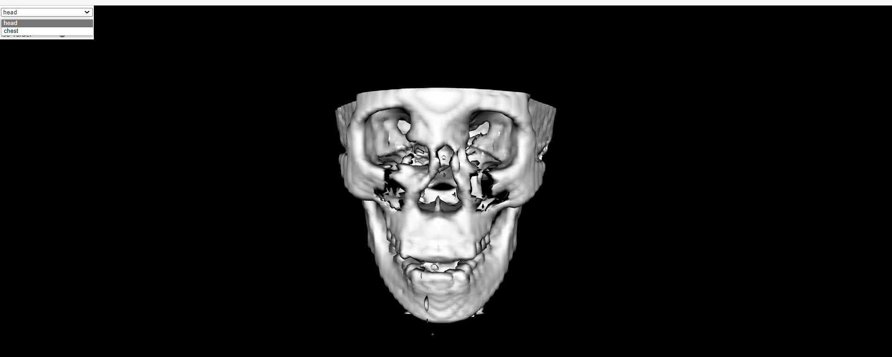

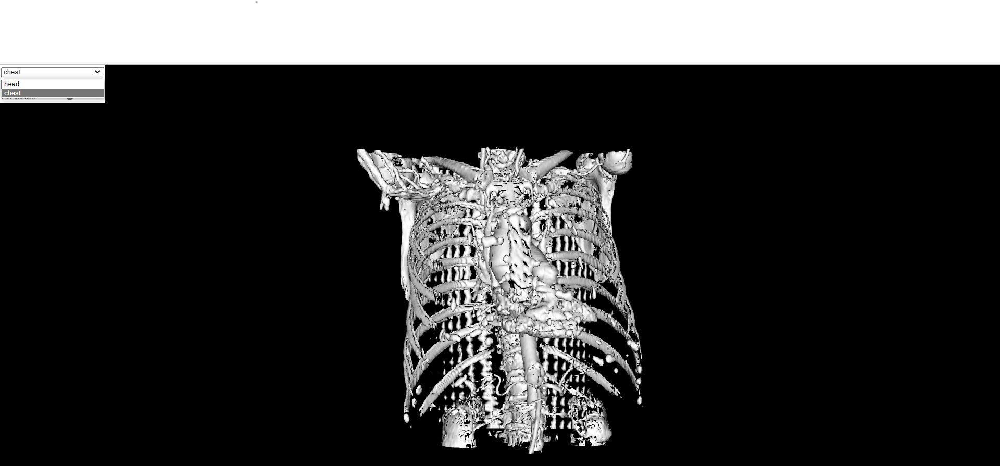

<a name="volume_ray"></a>

## switching between rendering modes (volume rendering/ray casting rendering)

since we have to modes to switch between, we declare a constant with the name renderingMode with a default value =0

```js
    const [ renderingMode, setRenderingMode] = useState(0);

```

whenever renderingMode=0 --> surface rendering mode (Marching cubes) (default)

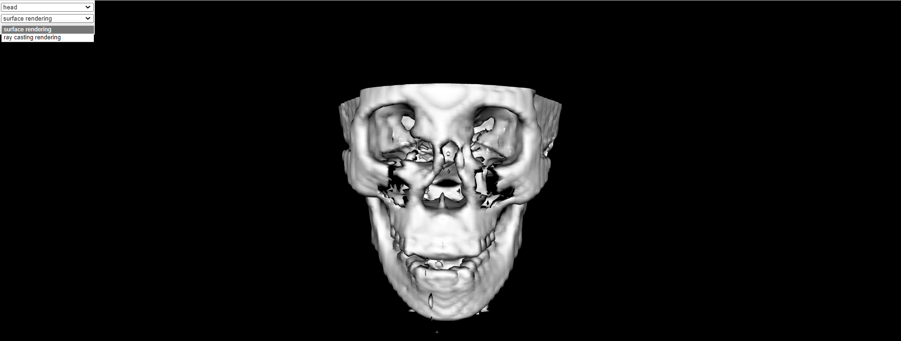

on the other hand, if renderingMode=1 --> ray casting rendering mode

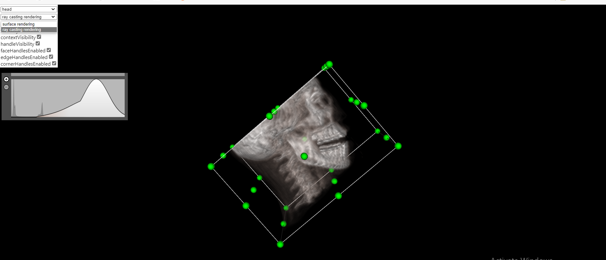

this will also be our index to choose the suitable actor and mapper from the following arrays:

```js
    const actor = [vtkActor.newInstance(),vtkVolume.newInstance()];
    const mapper = [vtkMapper.newInstance(),vtkVolumeMapper.newInstance()];
```

Notice that:

vtkActor and vtkMapper are used in case of surface rendering

vtkVolume and vtkVolumeMapper are used in case of ray casting rendering

this is the button to switch between both modes:

```js
                <tbody>
                    <select
                        value={renderingMode}
                        style={{ width: '100%' }}
                        onInput={(ev) => setRenderingMode(Number(ev.target.value))}
                    >
                        <option value="0">surface rendering</option>
                        <option value="1">ray casting rendering</option>
                    </select>
                </tbody>
```

<a name="iso"></a>

## Surface rendering (with marching cubes algorithm)

Notice-->  this is only applied when our renderingMode is set to be zero which is the default on launching our app

we need to get an object from vtkImageMarchingCubes class provideed by vtk

```js
  const marchingCube = vtkImageMarchingCubes.newInstance({
        contourValue: 0.0,
        computeNormals: true,
        mergePoints: true,
    });
    
 ```

 connecting our actor and mapper with the marching cube object

 ```js
        actor[renderingMode].setMapper(mapper[renderingMode])
        mapper[renderingMode].setInputConnection(marchingCube.getOutputPort())
        marchingCube.setInputConnection(reader.getOutputPort())
```

finally, we can control iso value via a slider:

```js
   const handleIsoValueChange = (e) => {
      const value = Number(e.target.value);
      console.log(value);
      const firstIsoValue = (globalDataRange[0] + globalDataRange[1]) / value;
      marchingCube.setContourValue(firstIsoValue);
      renderWindow.render();
    } 

```

here's the result of maximum iso value:

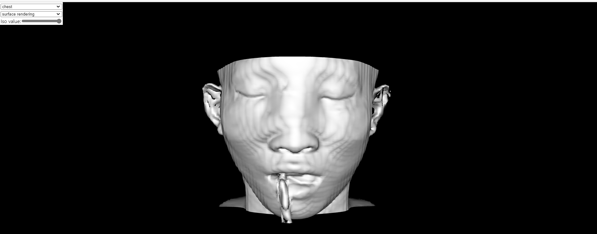

intermediate iso value:

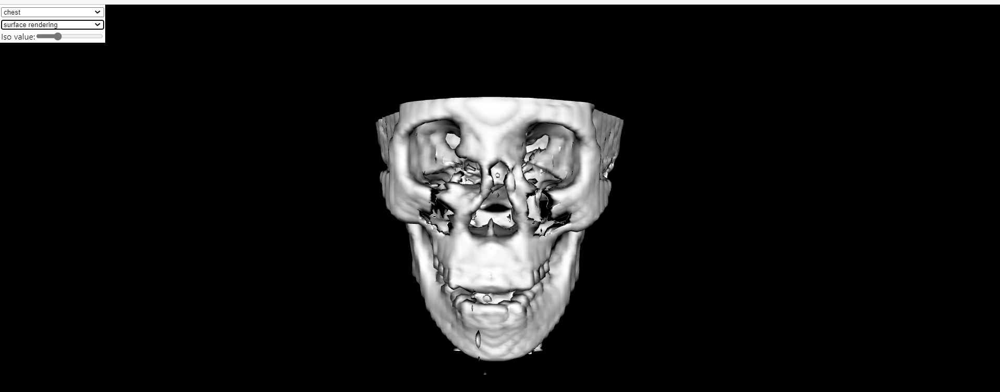

low iso value:

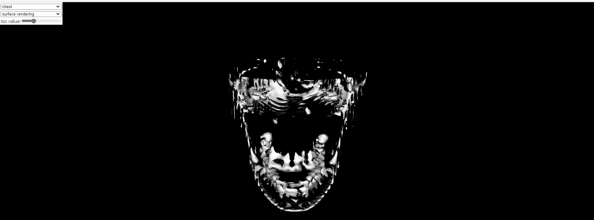

<a name="cropping"></a>

## Widget manager & Widget

First we have to create our widget manager & cropping widget

```js
 const widgetManager = vtkWidgetManager.newInstance();
    

 const widget = vtkImageCroppingWidget.newInstance();
```

Widget registration adds croping planes to our scene and calculate it's coordiantes.

```js
 function widgetRegistration(e) {
        const action = e ? e.currentTarget.dataset.action : 'addWidget';
        const viewWidget = widgetManager[action](widget);
        if (viewWidget) {

            viewWidget.setDisplayCallback((coords) => {
                
                overlay.style.left = '-100px';
                
                if (coords) {
                    const [w, h] = apiRenderWindow.getSize();
                    overlay.style.left = `${Math.round(
                    (coords[0][0] / w) * window.innerWidth -
                        overlaySize * 0.5 -
                        overlayBorder
                    )}px`;
                    overlay.style.top = `${Math.round(
                    ((h - coords[0][1]) / h) * window.innerHeight -
                        overlaySize * 0.5 -
                        overlayBorder
                    )}px`;
                }

            });
```

In the next code segment , we get the image data from the url choosen according to renderingmode,then we send this image to our cropping widget,creating a variable to hold cropstate and another one for the plane,when the cropstate is changed we send mapper new clipped data so cropping appear.

```js
reader.setUrl(URLs[0]).then(() => {
    reader.loadData().then(() => {
        const image = reader.getOutputData();
const image = reader.getOutputData();

        // update crop widget
        widget.copyImageDataDescription(image);
        const cropState = widget.getWidgetState().getCroppingPlanes();
        cropState.onModified(() => {
        const planes = getCroppingPlanes(image, cropState.getPlanes());
        mapper[renderingMode].removeAllClippingPlanes();
        planes.forEach((plane) => {
            mapper[renderingMode].addClippingPlane(plane);
        });
        mapper[renderingMode].modified();
        });
```

in our wedigt for raycasting rendering we have checkboxes to do some functions

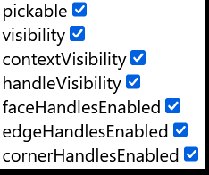

to apply change from checking box we created  a function called handleCheckChange

```js
const handleCheckChange = (e) => {
        const value = e.target.checked;
        const name = e.currentTarget.dataset.name;
        widget.set({ [name]: value }); // can be called on either viewWidget or parentWidget
        widgetManager.enablePicking();
        // renderWindow.render();
    };
```

this function is called in our react part

```js
<span>pickable</span>
                    <input data-name="pickable" type="checkbox" defaultChecked = {true} onChange = {handleCheckChange}/>
                </tbody>
                <tbody
                    style={{display:renderingMode===0?'none':'flex'}}
                >
                    <span>visibility</span>
                    <input data-name="visibility" type="checkbox" defaultChecked = {true} onChange = {handleCheckChange}/>
                </tbody>
                <tbody
                    style={{display:renderingMode===0?'none':'flex'}}
                >
                    <span>contextVisibility</span>
                    <input data-name="contextVisibility" type="checkbox" defaultChecked = {true} onChange = {handleCheckChange}/>
                </tbody>
                <tbody
                    style={{display:renderingMode===0?'none':'flex'}}
                >
                    <span>handleVisibility</span>
                    <input data-name="handleVisibility" type="checkbox" defaultChecked = {true} onChange = {handleCheckChange}/>
                </tbody>
                <tbody
                    style={{display:renderingMode===0?'none':'flex'}}
                >
                    <span>faceHandlesEnabled</span>
                    <input data-name="faceHandlesEnabled" type="checkbox" defaultChecked = {true} onChange = {handleCheckChange}/>
                </tbody>
                <tbody
                    style={{display:renderingMode===0?'none':'flex'}}
                >
                    <span>edgeHandlesEnabled</span>
                    <input data-name="edgeHandlesEnabled" type="checkbox" defaultChecked = {true} onChange = {handleCheckChange}/>
                </tbody>
                <tbody
                    style={{display:renderingMode===0?'none':'flex'}}
                >
                    <span>cornerHandlesEnabled</span>
                    <input data-name="cornerHandlesEnabled" type="checkbox" defaultChecked = {true} onChange = {handleCheckChange}/>
                </tbody>
```

the react code shows widget on window, and hnadleCheckChange is called everytime you check a box , it ets name and value of each bos and apply change wanted according to them,
please take notice that this widget with the boxes wont appear if rendering mode is surface rendering.

## Cropping planes

We also have a function that gets planes that will be cropped

```js
function getCroppingPlanes(imageData, ijkPlanes) {
        
        const rotation = quat.create();
        mat4.getRotation(rotation, imageData.getIndexToWorld());

        const rotateVec = (vec) => {
            const out = [0, 0, 0];
            vec3.transformQuat(out, vec, rotation);
            return out;
        };
```

we set the original position along with the corner and the center of the cropping cube

```js
const [iMin, iMax, jMin, jMax, kMin, kMax] = ijkPlanes;
        const origin = imageData.indexToWorld([iMin, jMin, kMin]);
        // opposite corner from origin
        const corner = imageData.indexToWorld([iMax, jMax, kMax]);

        return [
            // X min/max
            vtkPlane.newInstance({ normal: rotateVec([1, 0, 0]), origin }),
            vtkPlane.newInstance({ normal: rotateVec([-1, 0, 0]), origin: corner }),
            // Y min/max
            vtkPlane.newInstance({ normal: rotateVec([0, 1, 0]), origin }),
            vtkPlane.newInstance({ normal: rotateVec([0, -1, 0]), origin: corner }),
            // Z min/max
            vtkPlane.newInstance({ normal: rotateVec([0, 0, 1]), origin }),
            vtkPlane.newInstance({ normal: rotateVec([0, 0, -1]), origin: corner }),
        ];
```

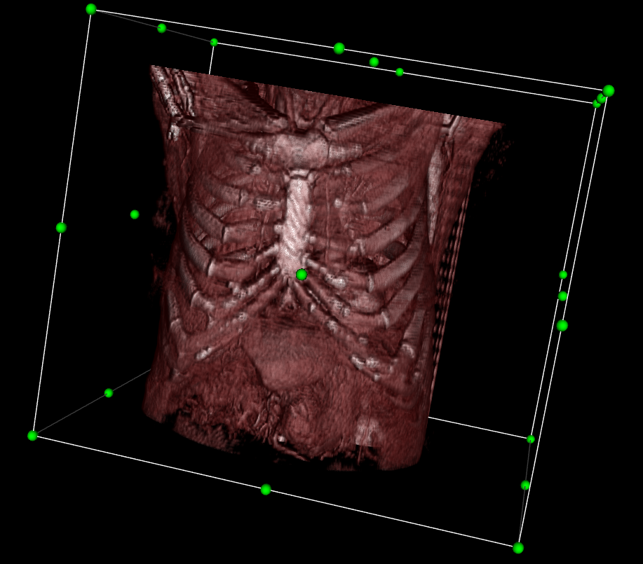

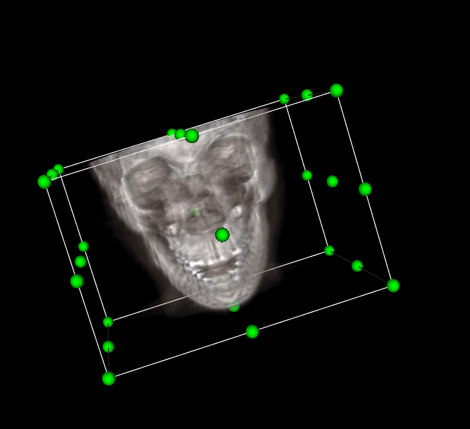

<a name="fixed_transfer"></a>

## Ray casting rendering (with a fixed transfer function)

first, we get an object from vtkColorTransferFunction class, let our object name be ctfun:

```js
    const ctfun = vtkColorTransferFunction.newInstance();

```

we add our onstatnt rgb points: (we can manipulate the rgb values in our code to get whatever color we please):

```js
        ctfun.addRGBPoint(0, 85 / 255.0, 0, 0);
        ctfun.addRGBPoint(95, 1.0, 1.0, 1.0);
        ctfun.addRGBPoint(850, 0.9, 0.74, 0.67);
        ctfun.addRGBPoint(2000, 1.0, 1.0, 1.0);
```

Now, we have to pass ctfn object to our actor:

```js
        actor[renderingMode].getProperty().setRGBTransferFunction(0, ctfun);
```

<a name="dynamic_transfer"></a>

## Ray casting rendering (with adjustable transfer function: Bonus)

we create a widget to control our dynamic transfer function:

```js
    const ofunwid = vtkPiecewiseGaussianWidget.newInstance({
      numberOfBins: 256,
      size: [400, 150],
    });
    
    const widgetContainer = document.createElement('div');
    widgetContainer.setAttribute("id","deleteable");
    widgetContainer.style.zIndex = "2";
    widgetContainer.style.width = "400px";
    widgetContainer.style.height = "150px";
    widgetContainer.style.position = 'absolute';
    widgetContainer.style.top = 'calc(200px + 1em)';
    widgetContainer.style.left = '5px';
    widgetContainer.style.background = 'rgba(255, 255, 255, 0.3)';
    ofunwid.setContainer(widgetContainer);
```

```js
Here, we are just updating the style of our widget:

        ofunwid.updateStyle({
          backgroundColor: 'rgba(255, 255, 255, 0.6)',
          histogramColor: 'rgba(100, 100, 100, 0.5)',
          strokeColor: 'rgb(0, 0, 0)',
          activeColor: 'rgb(255, 255, 255)',
          handleColor: 'rgb(50, 150, 50)',
          buttonDisableFillColor: 'rgba(255, 255, 255, 0.5)',
          buttonDisableStrokeColor: 'rgba(0, 0, 0, 0.5)',
          buttonStrokeColor: 'rgba(0, 0, 0, 1)',
          buttonFillColor: 'rgba(255, 255, 255, 1)',
          strokeWidth: 2,
          activeStrokeWidth: 3,
          buttonStrokeWidth: 1.5,
          handleWidth: 3,
          iconSize: 20, // Can be 0 if you want to remove buttons (dblClick for (+) / rightClick for (-))
          padding: 10,
        });
```

as usual, we get an object from vtkPiecewiseFunction class, we name it ofun: (our opacity object)

```js
const ofun = vtkPiecewiseFunction.newInstance();

```

we pass it to our actor:

```js
actor[renderingMode].getProperty().setScalarOpacity(0, ofun);
```

the default on choosing ray casting rendering mode:

```js
          const dataArray = image.getPointData().getScalars();
          ofunwid.setDataArray(dataArray.getData());
          ofunwid.applyOpacity(ofun);

          ofunwid.setColorTransferFunction(ctfun);
          ctfun.onModified(() => {
              ofunwid.render();
              renderWindow.render();
          });  
```

to interact with the widget:

```js
    ofunwid.addGaussian(0.425, 0.5, 0.2, 0.3, 0.2);
    ofunwid.addGaussian(0.75, 1, 0.3, 0, 0);

    ofunwid.setContainer(widgetContainer);
    ofunwid.bindMouseListeners();

    ofunwid.onAnimation((start) => {
    if (start) {
        renderWindow.getInteractor().requestAnimation(ofunwid);
    } else {
        renderWindow.getInteractor().cancelAnimation(ofunwid);
    }
    });

    ofunwid.onOpacityChange(() => {
    ofunwid.applyOpacity(ofun);
    if (!renderWindow.getInteractor().isAnimating()) {
        renderWindow.render();
    }
    });
```

Here's results sample to different opacity configuration: (dynamic transfer function)
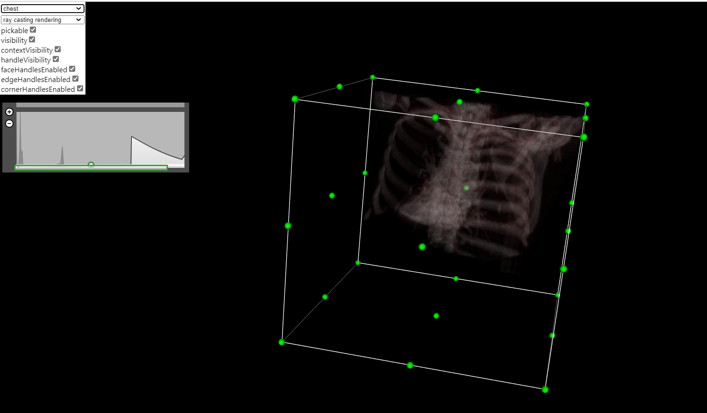

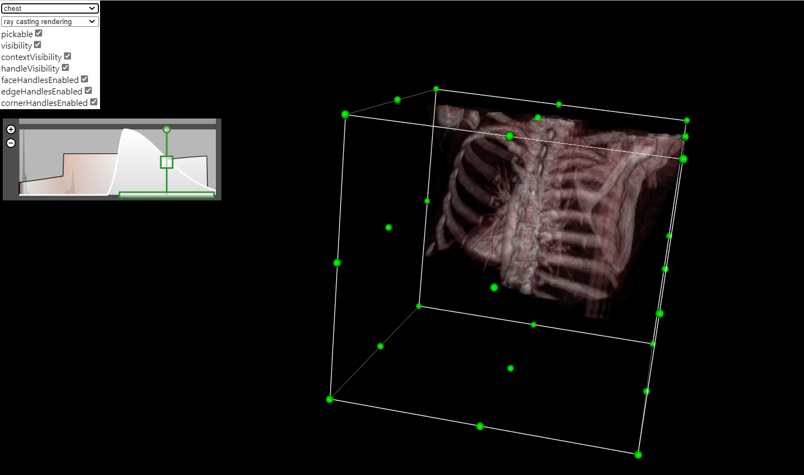

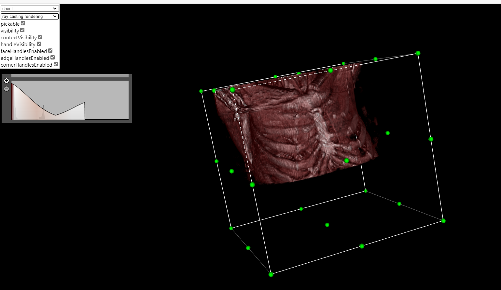
